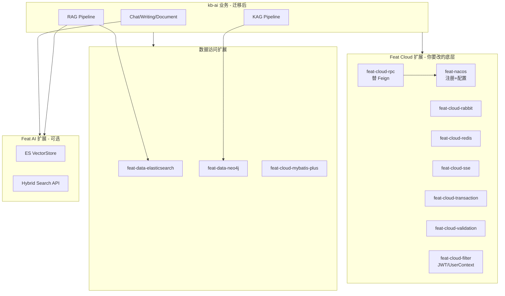

如果走「改 Feat 底层、让 kb-ai 整模块跑在 Feat 栈上」，Nacos 只是第一块拼图。下面按 **要补什么、优先级、模块划分** 说明。

---

## 总体思路：SPI 插件化，不要硬写进 feat-core

Feat 现有模式是 **编译期生成 `CloudService` + 运行期 `ServiceLoader` 加载**。底层扩展应沿用同一套路：

```
feat-cloud（核心）
    ├── feat-discovery-api          ← SPI 接口
    ├── feat-discovery-nacos        ← Nacos 实现（你要的）
    ├── feat-config-api
    ├── feat-config-nacos           ← 可与 discovery 合并为 feat-nacos
    ├── feat-cloud-messaging-rabbit
    ├── feat-cloud-redis
    ├── feat-cloud-rpc              ← 替代 OpenFeign
    ├── feat-cloud-sse              ← Controller 层 SSE
    └── feat-cloud-validation / transaction / openapi ...
```

业务服务（kb-ai）只引需要的 starter，和 Spring Cloud 的 `spring-cloud-starter-alibaba-nacos-*` 类似。

---

## 一、Nacos：要补什么（你已提到的）

kb-ai / 网关依赖 Nacos 做两件事，Feat 需分别抽象：

| 能力 | Spring 现状 | Feat 需新增 |
|------|------------|------------|
| **服务注册** | `nacos-discovery`，网关 `lb://kb-ai` | `DiscoveryService` SPI：register / deregister / heartbeat |
| **配置中心** | `nacos:kb-ai-dev.yaml` 动态刷新 | `ConfigService` SPI：get / listen / refresh |
| **元数据** | `developer`、`group=${COMPUTER_ID}` | 注册时带 metadata，兼容多开发者隔离 |
| **生命周期** | Spring 自动注册/下线 | `CloudService.onStart()` / `onStop()` 钩子里调 Nacos |

**建议 API 草图：**

```java
// feat-discovery-api
public interface DiscoveryService {
    void register(ServiceInstance instance);
    void deregister(String serviceId);
    List<ServiceInstance> getInstances(String serviceName);
}

// feat-config-api  
public interface ConfigService {
    String get(String dataId, String group);
    void addListener(String dataId, ConfigChangeListener listener);
}
```

**feat-discovery-nacos 实现要点：**

- 直接依赖 `nacos-client`（运行期），不必等 Spring Cloud
- 启动读 `feat.yml` 里的 `nacos.server-addr / namespace / group`
- 服务名 `kb-ai`、端口、IP 与现有网关路由对齐
- 支持 `optional:nacos:xxx.yaml` 等价语义（配置不存在时不阻塞启动）

---

## 二、除 Nacos 外，kb-ai 还需要哪些 Feat 底层

对照 kb-ai 当前 **Spring 依赖**，缺这些就跑不起来：

### P0 — 没有就无法替换 Spring Boot

| 模块 | kb-ai 用途 | Feat 现状 | 需做 |
|------|-----------|----------|------|
| **feat-cloud-rabbit** | `ReindexConsumer`、`KAGReindexConsumer` 异步重建 | ❌ 无 | `@RabbitListener` 等价注解 + 手动 ACK + JSON 反序列化 + DLX |
| **feat-cloud-redis** | Embedding 缓存、重建进度 | ⚠️ 仅有 Session | 通用 Redis 客户端/模板：get/set/hash/expire |
| **feat-cloud-rpc** | `DocumentFeignClient`、`GraphFeignClient` | ❌ 无 Feign | 声明式 HTTP 客户端 + 接 `DiscoveryService` 做 `lb://kb-document` |
| **feat-cloud-sse** | Chat/RAG/Writing 流式输出 | ⚠️ Core 有底层 `SSEUpgrade`，Cloud 无注解 | Controller 返回 `SseStream` 或 `@SseMapping`，封装 `SseEmitter` |
| **feat-cloud-validation** | `@Validated` DTO 校验 | ❌ 未确认 | 集成 Jakarta Validation |
| **feat-cloud-transaction** | 对话/反馈 `@Transactional` | ❌ 无 | JDBC 事务管理器 + `@Transactional` 编译期生成 |
| **feat-cloud-exception** | 统一 `Result` 错误响应 | ⚠️ 有 `RestResult` | 全局异常拦截，对齐 kb-common 的 `Result`/`BusinessException` |
| **feat-cloud-filter** | JWT / 用户上下文 | ❌ 无 | Request 过滤器链，解析 Gateway 传来的 Token → `UserContext` |

### P1 — 能跑但 RAG/KAG 功能残缺

| 模块 | kb-ai 用途 | 说明 |
|------|-----------|------|
| **feat-data-elasticsearch** | BM25 + kNN + bulk 写入 | kb-ai 深度用 ES Client + ik 分词；Feat AI 只有 Milvus/Chroma |
| **feat-data-neo4j** | KAG 图谱构建/多跳检索 | 无 Spring Data Neo4j 等价物；需 Neo4j Driver + Cypher 封装 |
| **feat-cloud-mybatis-plus** | 对话/消息/反馈 DAO | Feat 有 MyBatis，但 kb-ai 用 MyBatis Plus 特性（分页、自动填充） |
| **feat-cloud-conditional** | `@ConditionalOnProperty(rag.enabled)` | 条件装配等价机制 |
| **feat-cloud-openapi** | Knife4j 文档 | 可选，不影响功能 |

### P2 — 生产运维

| 模块 | 用途 |
|------|------|
| **feat-cloud-actuator** | `/health`、`/ready` 供 K8s/网关探活 |
| **feat-cloud-metrics** | LLM 调用耗时、MQ 消费 lag |
| **feat-cloud-scheduler** | 定时补偿重建、清理过期缓存 |
| **feat-cloud-multids-tx** | MySQL + Neo4j 双事务源路由（kb-ai 已有 `TransactionManagerConfig` 问题） |

---

## 三、Feat AI 层还要扩什么（不是 Feat Cloud，但和 kb-ai 相关）

若 RAG 也想尽量走 Feat AI，还需补：

| 能力 | 现状 | kb-ai 需要 |
|------|------|-----------|
| **Elasticsearch VectorStore** | ❌ 只有 Chroma/Milvus | ES 是默认向量后端，需 ES adapter |
| **Hybrid Search（BM25+kNN+RRF）** | Milvus 有 HybridSearch | 与 kb-ai `HybridSearchFusion` 对齐的统一 API |
| **RerankerModel** | ✅ 已有 | 可直接替 LLM 打分 rerank |
| **Batch Embedding + 缓存钩子** | 有 embed batch | 需 Redis 缓存 SPI 回调 |
| **KAG** | ❌ 无 | 图谱是业务层，不应进 Feat AI；保留 kb-ai 自研 |

---

## 四、架构关系图



---

## 五、实施优先级（若真改 Feat 底层）

| 阶段 | 模块 | 目标 |
|------|------|------|
| **Phase 1** | `feat-nacos` + `feat-cloud-rpc` + `feat-cloud-filter` | 能注册到网关、能调 kb-document/kb-graph、能识别用户 |
| **Phase 2** | `feat-cloud-sse` + `feat-cloud-validation` + `feat-cloud-exception` | Chat 流式 + API 契约与现网一致 |
| **Phase 3** | `feat-cloud-rabbit` + `feat-cloud-redis` + `feat-cloud-transaction` | RAG/KAG 异步重建 + 对话持久化 |
| **Phase 4** | `feat-data-elasticsearch` + `feat-data-neo4j` | 完整 RAG/KAG |
| **Phase 5** | Feat AI ES VectorStore、OpenAPI、Metrics | 优化与观测 |

---

## 六、哪些不必进 Feat 底层（直接用 SDK + registerBean）

降低改造量，这些可以 **不做成 Feat 官方模块**，启动时 `registerBean` 即可：

- Milvus SDK（Feat AI 已有 Milvus）
- Jackson / FastJSON2
- Caffeine 本地缓存
- JWT 解析库（jjwt）
- Druid 连接池

---

## 七、和「只换 Feat AI、保留 Spring」的对比

| 路径 | 需改 Feat 底层 | 工作量 | 风险 |
|------|---------------|--------|------|
| **Spring + Feat AI 替 LangChain4j** | 0 | 小 | 低 |
| **Feat Cloud + 自研 Nacos/Rabbit/ES/Neo4j 胶水** | 6~8 个模块 | 大 | 中 |
| **Feat 官方补齐上述模块后再迁 kb-ai** | 10+ 模块 | 很大 | 高，但可复用 |

---

## 八、直接回答

**改 Feat 底层支持 kb-ai 全量 Feat 化，Nacos 之外至少还需要：**

1. **feat-cloud-rpc**（替 Feign + 服务发现）
2. **feat-cloud-rabbit**（RAG/KAG 异步任务）
3. **feat-cloud-redis**（缓存 + 进度，不止 Session）
4. **feat-cloud-sse**（Cloud Controller 流式）
5. **feat-cloud-transaction + validation + exception + filter**（数据一致性、DTO 校验、统一响应、JWT 用户上下文）
6. **feat-data-elasticsearch + feat-data-neo4j**（RAG/KAG 核心存储）
7. **feat-cloud-mybatis-plus**（或增强现有 MyBatis 集成）

**Feat AI 侧可选补：** Elasticsearch VectorStore、统一 Hybrid Search API。

---

若你打算 **参与 Feat 上游贡献**，建议第一批 PR 只做 **`feat-discovery-api` + `feat-discovery-nacos` + `feat-config-nacos`**，再跟 **`feat-cloud-rpc`**——这三项打通后，kb-ai 至少能「注册进网关 + 调其他微服务」，其余可以渐进补。

需要的话我可以下一步出 **`feat-nacos` + `feat-cloud-rpc` 的接口定义和 feat.yml 配置草案**（对齐你们现有 `application.yml`）。