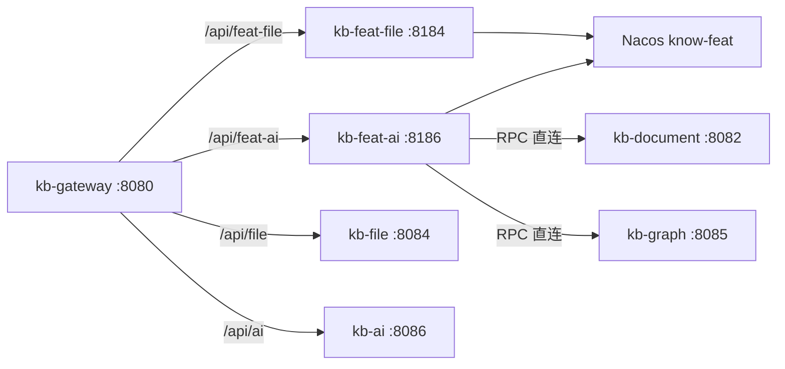

# kb-feat-file / kb-feat-ai 替换规划清单

> **原则**：不覆盖 `kb-file`、`kb-ai`；并行新建 **`kb-feat-file`**、**`kb-feat-ai`**。  
> **架构依据**：[cha.md](./cha.md) | 合并目标见 [service-merge-plan.md](./service-merge-plan.md)（kb-feat-ai = kb-intelligence 的 Feat 实现）  
> **Nacos**：`127.0.0.1:8848`，`nacos/nacos`，命名空间 **`know-feat`**  
> **Feat 底层**：已放在 `docs/feat/`（本地 `mvn install` 后引用 `2.2.0`）

---

## 一、模块对照

| 维度 | Spring 现网 | Feat 新建 | 说明 |
|------|-------------|-----------|------|
| Maven 模块 | `kb-file` | **`kb-feat-file`** | Media Domain |
| Maven 模块 | `kb-ai` | **`kb-feat-ai`** | Intelligence Domain（内部分层） |
| 端口 | 8084 | **8184** | 并行不冲突 |
| 端口 | 8086 | **8186** | 并行不冲突 |
| Nacos 服务名 | kb-file / kb-ai | **kb-feat-file / kb-feat-ai** | 仅 know-feat |
| 网关前缀 | `/api/file/**` | **`/api/feat-file/**`** | StripPrefix=2 |
| 网关前缀 | `/api/ai/**` | **`/api/feat-ai/**`** | StripPrefix=2 |
| 数据库 | kb_file / kb_ai | **同库同表** | 试点期共用，便于对比 |

---

## 二、总体架构



**内部分工（kb-feat-ai）**

```text
kb-feat-ai/
├── gateway/       # Chat / Writing / Document AI（Feat AI）
├── rag/           # 分块、Embedding、检索、索引
├── kag/           # 抽取、Neo4j、融合检索
├── infra/         # RPC、Redis、MQ、MyBatis
└── controller/    # 对外 API（与 kb-ai 路径一致）
```

---

## 三、已完成 vs 待做（总览）

| 序号 | 项 | 状态 | 位置 |
|------|----|------|------|
| ✅ | feat-discovery-api | 完成 | `docs/feat/feat-discovery-api` |
| ✅ | feat-config-nacos | 完成 | `docs/feat/feat-config-nacos` |
| ✅ | feat-discovery-nacos | 完成 | `docs/feat/feat-discovery-nacos` |
| ✅ | feat-cloud-rpc | 完成 | `docs/feat/feat-cloud-rpc` |
| ⬜ | Nacos 命名空间 know-feat | 待做 | 控制台 |
| ⬜ | Nacos 配置 DataId | 待做 | 见 §四 |
| ⬜ | backend 模块 kb-feat-file | 待做 | `backend/kb-feat-file` |
| ⬜ | backend 模块 kb-feat-ai | 待做 | `backend/kb-feat-ai` |
| ⬜ | kb-feat-common（可选） | 待评估 | Result/VO 共享 |
| ⬜ | 网关增量路由 | 待做 | `kb-gateway` |
| ⬜ | 前端试点开关 | 待做 | baseURL 切换 |

---

## 四、环境与配置清单

### 4.1 Nacos（一次性）

- [ ] 创建命名空间 **`know-feat`**
- [ ] 创建配置 **`kb-feat-file-dev.yaml`**（Group: `KNOWLEDGE_BASE`）
- [ ] 创建配置 **`kb-feat-ai-dev.yaml`**（Group: `KNOWLEDGE_BASE`）

### 4.2 kb-feat-file-dev.yaml 要点

```yaml
# MySQL kb_file、S3 endpoint/bucket/ak/sk、上传大小限制等
datasource:
  url: jdbc:mysql://localhost:3306/kb_file?...
file:
  storage:
    type: s3
    s3:
      endpoint: ...
      bucket: ...
```

### 4.3 kb-feat-ai-dev.yaml 要点

```yaml
# LLM、ES、Neo4j、RabbitMQ、Redis
llm:
  qwen:
    api-key: ...
elasticsearch:
  uris: http://127.0.0.1:9200
neo4j:
  uri: bolt://127.0.0.1:7687
rabbitmq:
  host: 127.0.0.1
redis:
  host: 127.0.0.1
# 试点期 Spring 服务直连（不跨 namespace）
rpc:
  kb-document:
    url: http://127.0.0.1:8082
  kb-graph:
    url: http://127.0.0.1:8085
```

### 4.4 统一 feat.yml 模板

**kb-feat-file**

```yaml
server:
  port: 8184
feat:
  nacos:
    server-addr: 127.0.0.1:8848
    namespace: know-feat
    username: nacos
    password: nacos
    discovery:
      service-name: kb-feat-file
      group: ${COMPUTER_ID:default}
      ip: 127.0.0.1
    config:
      group: KNOWLEDGE_BASE
      imports:
        - data-id: kb-feat-file-dev.yaml
          optional: true
```

**kb-feat-ai** — 同上，`port: 8186`，`service-name: kb-feat-ai`，`kb-feat-ai-dev.yaml`。

### 4.5 网关（kb-gateway 增量，不删旧路由）

```yaml
- id: kb-feat-file
  uri: http://127.0.0.1:8184    # S0 静态；后续改 lb://kb-feat-file
  predicates:
    - Path=/api/feat-file/**
  filters:
    - StripPrefix=2

- id: kb-feat-ai
  uri: http://127.0.0.1:8186
  predicates:
    - Path=/api/feat-ai/**
  filters:
    - StripPrefix=2
```

白名单增加：`/api/feat-file/**`、`/api/feat-ai/**`。

---

## 五、backend 工程结构

```text
backend/
├── pom.xml                    # + kb-feat-file、kb-feat-ai
├── kb-feat-common/            # 可选：Result、PageResult、BusinessException
├── kb-feat-file/
│   ├── pom.xml
│   ├── src/main/java/com/knowledge/base/feat/file/
│   │   ├── Bootstrap.java
│   │   ├── controller/
│   │   ├── service/
│   │   └── storage/           # 从 kb-file S3FileStorage 移植
│   └── src/main/resources/
│       ├── feat.yml
│       └── mybatis/
└── kb-feat-ai/
    ├── pom.xml
    ├── src/main/java/com/knowledge/base/feat/ai/
    │   ├── Bootstrap.java
    │   ├── controller/
    │   ├── gateway/
    │   ├── rag/
    │   ├── kag/
    │   ├── infra/rpc/
    │   └── infra/mq/
    └── src/main/resources/
        └── feat.yml
```

### 5.1 公共依赖（两个模块 pom）

```xml
<!-- Feat Cloud -->
<dependency>
    <groupId>tech.smartboot.feat</groupId>
    <artifactId>feat-cloud</artifactId>
    <version>2.2.0</version>
</dependency>
<dependency>
    <groupId>tech.smartboot.feat</groupId>
    <artifactId>feat-cloud-starter</artifactId>
    <version>2.2.0</version>
    <scope>provided</scope>
</dependency>
<dependency>
    <groupId>tech.smartboot.feat</groupId>
    <artifactId>feat-discovery-nacos</artifactId>
    <version>2.2.0</version>
</dependency>
<!-- kb-feat-ai 额外 -->
<dependency>
    <groupId>tech.smartboot.feat</groupId>
    <artifactId>feat-cloud-rpc</artifactId>
    <version>2.2.0</version>
</dependency>
<dependency>
    <groupId>tech.smartboot.feat</groupId>
    <artifactId>feat-ai</artifactId>
    <version>2.2.0</version>
</dependency>
```

打包 Fat Jar 需合并 `META-INF/services/tech.smartboot.feat.cloud.CloudService`（见 `docs/feat/demo/nacos-rpc/pom.xml`）。

---

## 六、kb-feat-file 替换清单

> 源：`backend/kb-file` | 控制器：`FileController`、`CategoryController`

### Phase F0 — 骨架（1~2 天）

| # | 任务 | 验收 |
|---|------|------|
| F0-1 | 创建 `backend/kb-feat-file` 模块 + pom | `mvn compile` |
| F0-2 | `Bootstrap` + `@Controller` `/ping` | 返回 pong |
| F0-3 | `feat.yml` + Nacos 注册 `kb-feat-file` | 控制台可见 |
| F0-4 | 网关 `/api/feat-file/**` | curl 通 |

### Phase F1 — P0 核心（3~5 天）

| # | API（StripPrefix 后路径） | 源文件 | 验收 |
|---|---------------------------|--------|------|
| F1-1 | `POST /files/upload` | FileController | S3 + MySQL |
| F1-2 | `POST /files/upload/batch` | FileController | 批量上传 |
| F1-3 | `GET /files/download/{fileId}/**` | FileController | 下载 |
| F1-4 | `GET /files/{fileId}` | FileController | 元数据 |
| F1-5 | `POST /files/page` | FileController | 分页列表 |
| F1-6 | `DELETE /files/{fileId}` | FileController | 删除 |
| F1-7 | S3 存储层移植 | `S3FileStorage` | 与 Spring 同 bucket |

### Phase F2 — P1 分类（2~3 天）

| # | API | 源文件 |
|---|-----|--------|
| F2-1 | `POST/PUT/DELETE/GET /categories/**` | CategoryController |
| F2-2 | `GET /categories/tree` | CategoryController |
| F2-3 | `GET /files/preview/{fileId}` | FileController |
| F2-4 | `GET /files/thumbnail/{fileId}` | FileController |

### Phase F3 — P2 增强（按需）

| # | API | 说明 |
|---|-----|------|
| F3-1 | 断点续传 | `ResumableFileStorage` |
| F3-2 | `convert-url` / `batch-convert` | URL 转存 |
| F3-3 | HLS 流 `stream/{fileId}/**` | 视频分片 |

### kb-feat-file 还需的 Feat 扩展

| 能力 | 优先级 | 做法 |
|------|--------|------|
| MyBatis | P0 | Feat Cloud MyBatis 集成 |
| multipart 上传 | P0 | Feat Core 或手写 Upgrade |
| 统一 Result | P0 | kb-feat-common 或复制 kb-common |
| JWT/用户上下文 | P1 | Filter（若需登录态） |
| Validation | P1 | Jakarta Validation |

---

## 七、kb-feat-ai 替换清单

> 源：`backend/kb-ai` | 11 个 Controller

### Phase A0 — 骨架（1~2 天）

| # | 任务 | 验收 |
|---|------|------|
| A0-1 | 创建 `backend/kb-feat-ai` 模块 + pom | compile |
| A0-2 | `Bootstrap` + `/ping` | pong |
| A0-3 | Nacos 注册 `kb-feat-ai` | 控制台可见 |
| A0-4 | 网关 `/api/feat-ai/**` | curl 通 |

### Phase A1 — LLM Gateway（5~7 天）

| # | API | 源 Controller | 技术 |
|---|-----|---------------|------|
| A1-1 | `GET /chat/models` | AiChatController | Feat AI |
| A1-2 | `POST /chat` | AiChatController | Feat AI 同步 |
| A1-3 | `POST /chat/stream` | AiChatController | SSE（Core SSEUpgrade） |
| A1-4 | `POST /conversation` 等 | AiConversationController | MyBatis |
| A1-5 | `GET /conversation/list` | AiConversationController | |
| A1-6 | `GET /suggestions` | AiSuggestionController | yaml/静态 |

**缺口补齐（相对 Spring）**

- [ ] `GET /quick-questions`（前端若有调用，Feat 版一并实现）

### Phase A2 — 写作 & 文档 AI（3~5 天）

| # | API | 源 Controller |
|---|-----|---------------|
| A2-1 | `POST /writing/generate` (+ stream) | AiWritingController |
| A2-2 | `POST /writing/expand/optimize/continue` | AiWritingController |
| A2-3 | `GET /writing/templates` | AiWritingController |
| A2-4 | `POST /document/summary` (+ stream) | AiDocumentController |
| A2-5 | `POST /document/outline/expand/optimize` | AiDocumentController |
| A2-6 | `POST /feedback` | AiFeedbackController（路径统一 `/feedback`） |

### Phase A3 — RAG（7~10 天）

| # | API / 能力 | 源 | 依赖 |
|---|------------|-----|------|
| A3-1 | `POST /rag/search` | RagSearchController | ES + Embedding |
| A3-2 | `POST /rag/chat` (+ stream) | RagChatController | RAG 检索 + Feat AI |
| A3-3 | `POST /rag/reindex/*` | RagReindexController | MQ 触发 |
| A3-4 | `GET /rag/reindex/progress/{taskId}` | RagReindexController | Redis |
| A3-5 | Embedding 缓存 | EmbeddingServiceImpl | Redis |
| A3-6 | 向量索引 ES/Milvus | VectorIndexService | SDK registerBean |
| A3-7 | RPC 拉文档 | DocumentFeignClient → `@RpcClient` | feat-cloud-rpc |

### Phase A4 — KAG（5~7 天）

| # | API / 能力 | 源 | 依赖 |
|---|------------|-----|------|
| A4-1 | `POST /kag/chat` (+ stream) | KAGChatController | Neo4j + Feat AI |
| A4-2 | `POST /kag/search` | KAGChatController | |
| A4-3 | `POST /kag/build/*` | KAGReindexController | MQ |
| A4-4 | 图谱构建/检索 | GraphBuild / KAGRetrieval | Neo4j Driver |
| A4-5 | RPC 清图谱缓存 | GraphFeignClient | feat-cloud-rpc |

### kb-feat-ai 还需的 Feat 扩展

| 能力 | 阶段 | 做法 |
|------|------|------|
| feat-cloud-rpc | A3 | ✅ 已有 |
| SSE Controller 封装 | A1 | Core SSEUpgrade 或 feat-cloud-sse |
| Redis | A3 | redisun / Lettuce registerBean |
| RabbitMQ 消费者 | A3 | 自研 `@MqListener` 或 amqp-client |
| MyBatis + Transaction | A1 | Feat MyBatis + JDBC 事务 |
| ES / Neo4j | A3/A4 | 官方 SDK |
| Feat AI（Chat/Embedding/Rerank） | A1~A4 | 替 LangChain4j |
| JWT Filter | A1 | 解析 Gateway Token |

---

## 八、实施顺序（推荐）

```text
Week 1   [F0][A0]  两模块骨架 + Nacos + 网关
Week 2   [F1]      kb-feat-file 上传/下载/列表
Week 3   [F2][A1]  file 分类 + ai Chat/SSE/会话
Week 4   [A2]      Writing/Document/Feedback
Week 5~6 [A3]      RAG 全链路
Week 7~8 [A4]      KAG + 联调
Week 9          对比测试、前端试点、文档
```

**原则：先做 kb-feat-file（边界清晰），再做 kb-feat-ai（按 A1→A4 递进）。**

---

## 九、验收标准（模块级）

### kb-feat-file 可试点

- [ ] Nacos `know-feat` 可见 `kb-feat-file`
- [ ] `/api/feat-file/files/upload` 上传成功
- [ ] 与 `/api/file/files/upload` 返回 JSON 结构一致
- [ ] S3 对象与 Spring 版可互认（同 bucket）

### kb-feat-ai 可试点

- [ ] Nacos 可见 `kb-feat-ai`
- [ ] `/api/feat-ai/chat` 同步对话
- [ ] `/api/feat-ai/chat/stream` 流式输出
- [ ] RAG 语义搜索 + KAG 对话（Phase A3/A4 后）

### 整体

- [ ] `kb-file`、`kb-ai` 零改动仍可运行
- [ ] 前端仅改 baseURL 即可 A/B
- [ ] 全部 Feat 服务仅在 `know-feat` + 8184/8186

---

## 十、风险与决策

| 风险 | 对策 |
|------|------|
| 网关与 know-feat 跨 namespace | S0 用静态 `uri: http://127.0.0.1:818x` |
| kb-common 引 Spring | 抽 `kb-feat-common` 纯 POJO |
| Feat Cloud 授权 | file 可先用 Feat Core HTTP；ai 用 Feat AI 库 |
| 双 ES 索引（cha.md） | ai 阶段不合并 kb-search，RPC 或自含检索 |
| Document 四连 Feign | ai 重建走 MQ，不调 document 同步编排 |

---

## 十一、立即开工（Next 5）

1. [ ] Nacos 创建 `know-feat` + 两个 dev yaml
2. [ ] `backend/kb-feat-file`：Bootstrap + `/ping` + feat.yml
3. [ ] `backend/kb-feat-ai`：Bootstrap + `/ping` + feat.yml
4. [ ] `backend/pom.xml` 注册两模块
5. [ ] `kb-gateway` 增加 `/api/feat-file/**`、`/api/feat-ai/**`

---

*版本：2026-07-10 v2 | 模块名：kb-feat-file / kb-feat-ai*
