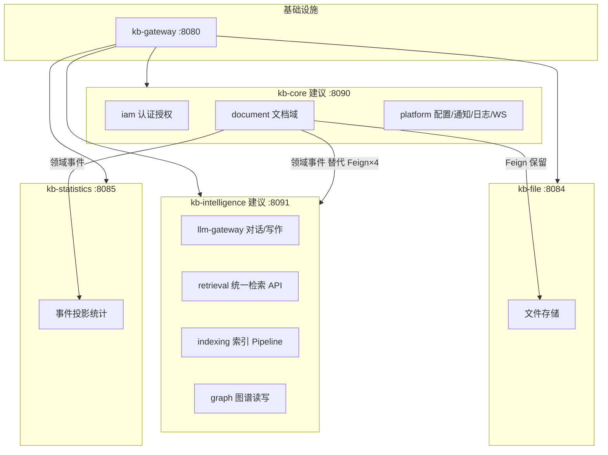

# 微服务合并计划：9 → 4 有界上下文

> **依据**：[cha.md](./cha.md) §1、§3、§4、§5  
> **原则**：合并部署单元，**不合并数据库**；网关 API 路径保持兼容；与 `kb-feat-file` / `kb-feat-ai` 路线对齐。  
> **版本**：2026-07-10 v1

---

## 一、现状与目标

### 1.1 当前 9 个运行单元

| # | 服务 | 端口 | 职责 | 合并去向 |
|---|------|------|------|----------|
| 1 | kb-gateway | 8080 | 路由、JWT | **保留**（基础设施） |
| 2 | kb-user-auth | 8081 | 认证、团队、权限 | → **kb-core** |
| 3 | kb-document | 8082 | 文档生命周期、编排中心 | → **kb-core** |
| 4 | kb-search | 8083 | 全文检索、搜索历史 | → **kb-intelligence** |
| 5 | kb-file | 8084 | 对象存储、文件元数据 | **保留**（Media） |
| 6 | kb-statistics | 8085 | 统计投影、报表 | **保留**（Analytics） |
| 7 | kb-ai | 8086 | LLM、RAG、KAG 写图谱 | → **kb-intelligence** |
| 8 | kb-graph | 8088 | 图谱查询、缓存 | → **kb-intelligence** |
| 9 | kb-foundation | 8089 | 配置、通知、字典、日志、WS | → **kb-core** |

> kb-common 为共享库，不是独立部署服务。

### 1.2 目标 4 个 BC + 网关



| 新 BC | 吸收服务 | Nacos 服务名（目标） | 说明 |
|-------|----------|----------------------|------|
| **kb-core** | user-auth + document + foundation | `kb-core` | 业务中枢，去掉对外 Feign 编排 |
| **kb-intelligence** | ai + search + graph | `kb-intelligence` | 检索/AI/图谱统一 Intelligence 域 |
| **kb-file** | — | `kb-file` | 不变 |
| **kb-statistics** | — | `kb-statistics` | 不变，去掉跨库 VIEW |

**合并数量**：9 个运行单元 → **4 个领域服务 + 1 个网关**（净减少 4 个 JVM）。

---

## 二、为什么要这样合（不是拍脑袋拆）

### 2.1 合并组 A：Intelligence（kb-ai + kb-search + kb-graph）

| 问题 | 现状 | 合并后 |
|------|------|--------|
| 双 ES 索引 | `kb_document`(search) + `kb_chunk`(ai) | 统一 **Indexing Pipeline**，对外一个 Retrieval API |
| 链式 Feign | search → feign → ai 做 hybrid | 进程内 Retriever Chain（keyword / vector / graph → RRF） |
| 图谱读写交叉 | ai 写 Neo4j + graph 读/删 Neo4j | 单一 Graph 子模块，读写边界在包内划分 |
| Document 编排 | Feign × 4（search/rag/kag/graph） | 发 **DocumentPublished** 事件，Intelligence 内部消费 |

**代码量级（估算）**：

| 源模块 | Controller | 关键依赖 |
|--------|------------|----------|
| kb-search | 2 | ES、MySQL(kb_search)、Feign→kb-ai |
| kb-ai | 11 | ES/Milvus、Neo4j、MySQL、MQ、Feign→document/graph |
| kb-graph | 1 | Neo4j、Redis |

### 2.2 合并组 B：Core（kb-user-auth + kb-document + kb-foundation）

| 问题 | 现状 | 合并后 |
|------|------|--------|
| 平台 Feign | foundation → user-auth | 进程内 IAM 模块调用 |
| 文档与权限 | 跨服务查用户/团队 | 同进程，保留逻辑分库 |
| 配置共享 | Redis SystemConfigCache 跨服务 | 仍可用 Redis，减少网络 hop |
| Document 编排 | 同步 Feign 触发索引 | **Phase 0 先改事件**，再合进程 |

**注意**：document 调 kb-file 的 Feign **保留**（Media 独立 BC 合理）。

### 2.3 不合并的 2 个

| 服务 | 理由 |
|------|------|
| **kb-file** | 边界清晰（S3 + 元数据），Media Domain 独立扩缩容 |
| **kb-statistics** | Analytics 读模型，应纯事件投影；合并进 Core 会再次耦合写路径 |

---

## 三、目标模块结构（Maven 多模块，单进程部署）

### 3.1 kb-intelligence（优先实施）

```text
backend/kb-intelligence/
├── pom.xml
├── kb-intelligence-app/          # 启动模块（Spring Boot / 未来 Feat Bootstrap）
├── kb-intelligence-llm/          # 原 kb-ai：chat/writing/suggestion/feedback
├── kb-intelligence-rag/          # 原 kb-ai：分块、embedding、向量索引
├── kb-intelligence-kag/          # 原 kb-ai：抽取、图谱构建
├── kb-intelligence-retrieval/    # 吸收 kb-search：统一 Search API + 搜索历史
├── kb-intelligence-graph/        # 吸收 kb-graph：Neo4j 查询/删除/缓存
└── kb-intelligence-infra/        # ES/Neo4j/MQ/Redis 配置、MQ 消费者
```

**对内包边界**：

```text
对外只暴露一套 Controller 前缀（网关兼容层见 §五）
├── /search/**     ← 原 kb-search
├── /ai/**         ← 原 kb-ai（chat/rag/kag 子路径不变）
└── /graph/**      ← 原 kb-graph
```

### 3.2 kb-core（第二阶段）

```text
backend/kb-core/
├── pom.xml
├── kb-core-app/
├── kb-core-iam/          # 原 kb-user-auth
├── kb-core-document/     # 原 kb-document
└── kb-core-platform/     # 原 kb-foundation
```

---

## 四、分阶段实施（推荐顺序）

### Phase 0 — 解耦 Document 编排（**不改部署**，1~2 周）

> 合并的前置条件：先消除 Document 对 Intelligence 的同步 Feign 依赖。

| 步骤 | 动作 | 验收 |
|------|------|------|
| P0-1 | 定义领域事件 `DocumentPublished` / `DocumentRemoved`（已有 MQ 则复用 routing key） | ✅ `DocumentLifecycleEventDTO` |
| P0-2 | kb-document 发布/更新/删除时 **只发事件**，Feign 调用改为 optional 或删除 | ✅ 默认 event-only |
| P0-3 | kb-ai 消费事件 → RAG/KAG 重建（已有 MQ 消费者则对齐） | ✅ `DocumentLifecycleListener` |
| P0-4 | kb-search 索引改为消费同一事件（或 Intelligence 内统一索引后废弃 doc-level ES） | ✅ ES 消费端 |
| P0-5 | kb-graph 删除改为消费 `DocumentRemoved` | ✅ graph 消费端 |

**此阶段结束后**：即使不合并 JVM，架构上已符合 cha.md 的「事件驱动 + Indexing BC」。

### Phase 1 — 合并 Intelligence（**3~4 周**）

| 步骤 | 动作 | 验收 |
|------|------|------|
| P1-1 | 新建 `backend/kb-intelligence` 多模块骨架，**复制**非移动（旧服务仍运行） | `mvn compile` |
| P1-2 | 迁入 kb-graph（最小，1 Controller） | `/graph/**` 集成测试通过 |
| P1-3 | 迁入 kb-search，**删除** `RagSearchFeignClient`，改调 rag 模块 | hybrid 搜索无跨进程调用 |
| P1-4 | 迁入 kb-ai 全量，**删除** `GraphFeignClient` | KAG 全链路单进程 |
| P1-5 | 统一 ES 索引策略（doc-level 与 chunk-level 策略二选一或 nested） | 检索结果与现网一致 |
| P1-6 | Nacos 注册 `kb-intelligence`，网关增加路由；旧 ai/search/graph **并行** | 前端可切换 |
| P1-7 | 稳定 2 周后下线 kb-ai、kb-search、kb-graph | Nacos 只剩 6 个领域服务 |

### Phase 2 — 合并 Core（**3~4 周**）

| 步骤 | 动作 | 验收 |
|------|------|------|
| P2-1 | 新建 `backend/kb-core` 多模块骨架 | compile |
| P2-2 | 迁入 kb-foundation → platform | 配置/通知/WS 正常 |
| P2-3 | 迁入 kb-user-auth → iam，foundation 的 UserAuthFeign 改本地 | 登录/权限正常 |
| P2-4 | 迁入 kb-document → document | 文档 CRUD + MongoDB |
| P2-5 | document 调 file 仍走 Feign（或后续 RPC） | 上传/download 正常 |
| P2-6 | 网关 `/api/auth/**`、`/api/document/**`、`/api/foundation/**` 指向 kb-core | 前端无感 |
| P2-7 | 下线 kb-user-auth、kb-document、kb-foundation | **剩 4 领域服务** |

### Phase 3 — Statistics 净化 + 网关收敛（**1~2 周**）

| 步骤 | 动作 |
|------|------|
| P3-1 | kb-statistics 跨库 VIEW 改为 MQ 事件写入本地宽表（cha.md §2） |
| P3-2 | 网关路由表从 8 条领域路由收敛为 4 条 |
| P3-3 | Nacos DataId / 部署文档 / 监控面板更新 |

---

## 五、网关兼容策略（前端零改动）

合并期间 **旧路由保留**，新服务用 **StripPrefix + 路径转发** 对齐原 API：

| 原路由前缀 | 合并后指向 | 说明 |
|------------|------------|------|
| `/api/ai/**` | kb-intelligence | 不变 |
| `/api/search/**` | kb-intelligence | 不变 |
| `/api/graph/**` | kb-intelligence | 不变 |
| `/api/auth/**` | kb-core | 不变 |
| `/api/document/**` | kb-core | 不变 |
| `/api/foundation/**` | kb-core | 不变 |
| `/api/file/**` | kb-file | 不变 |
| `/api/statistics/**` | kb-statistics | 不变 |

**并行期示例**（Phase 1）：

```yaml
# kb-gateway 增量，不删旧路由
- id: kb-intelligence
  uri: lb://kb-intelligence
  predicates:
    - Path=/api/ai/**,/api/search/**,/api/graph/**
  filters:
    - StripPrefix=1   # 按现有各服务 context-path 微调
```

---

## 六、数据与中间件

> **项目开发中，还未部署数据库中间件**（MySQL / ES / Neo4j / Redis / RabbitMQ 尚未在目标环境安装）。

| 数据源 | 策略 |
|--------|------|
| MySQL | **Intelligence BC** 使用单库 **`kb_intelligence`**（search + ai 表合入）；其余 BC 仍独立库（kb_user / kb_document / kb_foundation 等） |
| MongoDB | 仍仅 document 模块使用 |
| Elasticsearch | Intelligence 内统一客户端；索引 alias 迁移需专项脚本 |
| Neo4j | 仅 intelligence-graph 模块连接 |
| Redis | 按 module 前缀区分 key，避免冲突 |
| RabbitMQ | 队列名不变，消费者迁到 intelligence-app |

Intelligence SQL：`backend/sql/intelligence/`（总索引见 `backend/sql/README.md`）。

---

## 七、与 Feat 路线的关系

| Spring 合并目标 | Feat 对应 | 说明 |
|-----------------|-----------|------|
| kb-intelligence | **kb-feat-ai** 扩展版 | Feat 试点可直接按 intelligence 内部分包实现，不再单独建 search/graph Feat 服务 |
| kb-file | **kb-feat-file** | 不变 |
| kb-core | 暂用 Spring | IAM/Document/Platform 依赖 Spring Security/Mongo，Feat 化优先级低 |
| kb-statistics | 暂用 Spring | MQ + 定时任务，Feat 化 ROI 低 |

**调整 feat-file-ai-plan.md 的隐含前提**：

- kb-feat-ai 目标架构 = **kb-intelligence 的 Feat 实现**（含 retrieval + graph）
- 试点期 RPC 调 kb-document **不变**；合并 Core 后改为调 kb-core

---

## 八、风险与回滚

| 风险 | 缓解 |
|------|------|
| 单进程内存过大 | intelligence 预估 2~4G；可 JVM 调优，后期再拆读模型 |
| ES 索引迁移失败 | Phase 1 双写 + alias 切换，保留旧索引 7 天 |
| 合并后发布窗口变长 | 模块间接口化，CI 按子模块测试 |
| 回滚 | 并行期保留旧 Nacos 服务名，网关一键切回 lb://kb-ai 等 |

---

## 九、里程碑时间表（建议）

| 周次 | 里程碑 | 服务数 |
|------|--------|--------|
| W1~W2 | Phase 0 事件解耦 | 9（不变） |
| W3~W6 | Phase 1 Intelligence 上线并行 | 9→7（下线 ai/search/graph） |
| W7~W10 | Phase 2 Core 上线并行 | 7→4 |
| W11~W12 | Phase 3 统计净化 + 文档 | **4 领域 + 网关** |

---

## 十、Next 5（立即可做）

1. [x] **P0-1**：在 `kb-common` 定义 `DocumentLifecycleEventDTO` 契约
2. [x] **P0-2**：`DocumentServiceImpl` 索引触发改为「事件优先、Feign 兜底（feature flag）」
3. [x] **P1-1**：创建 `backend/kb-intelligence/` 空骨架（4 子模块 + app）
4. [ ] 更新 `feat-file-ai-plan.md`：kb-feat-ai 对齐 intelligence 分包
5. [ ] 网关预置 `kb-intelligence` 路由（disabled，合并完成后启用）

---

*关联文档：[cha.md](./cha.md) | [feat-file-ai-plan.md](./feat-file-ai-plan.md)*
