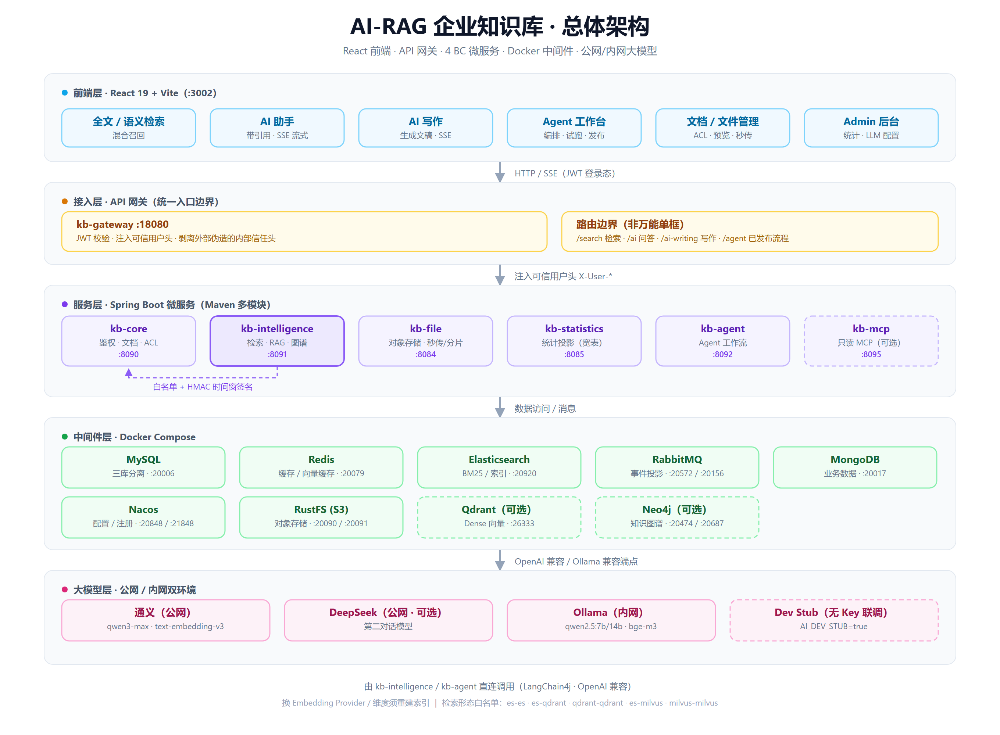
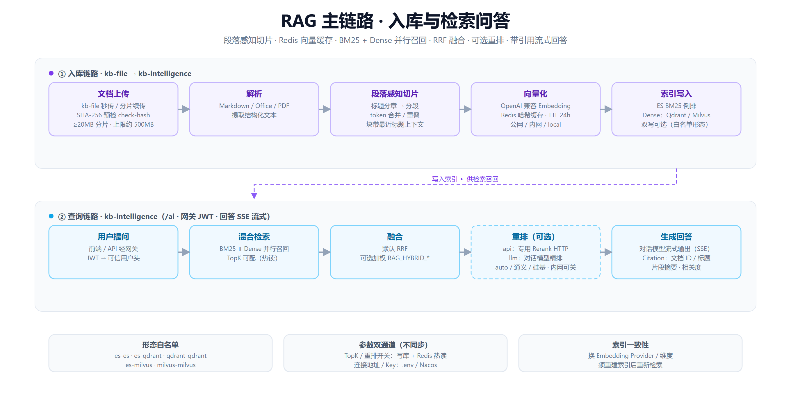
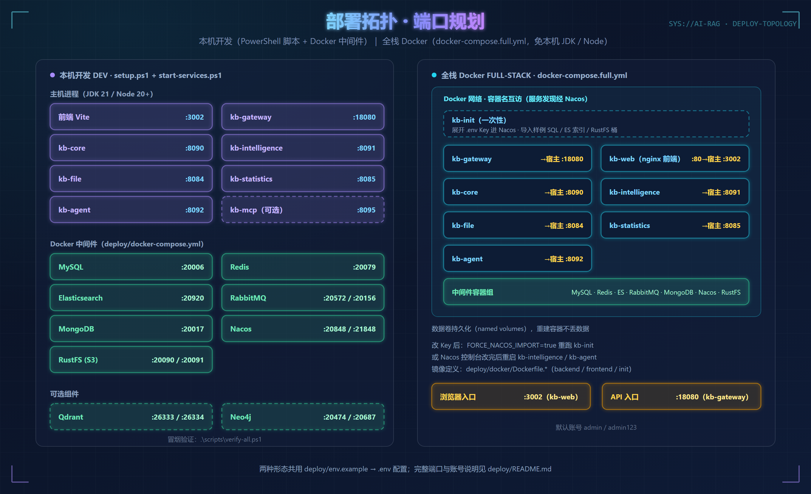

# AI-RAG 企业知识库

> 4 BC 微服务 + Gateway + Agent + React 前端的一体化企业知识库：文档管理、全文/语义混合检索、RAG 带引用问答、知识图谱、文件存储、Agent 工作流与 Admin 后台，支持公网/内网换模型与 Docker 交付。

   

仓库：[Gitee · xcmrfc-thanos/AI-RAG](https://gitee.com/xcmrfc-thanos/AI-RAG)

## 📖 目录导航

- [✨ 项目亮点](#-项目亮点)
- [🧠 核心技术](#-核心技术)
- [🏗 总体架构](#-总体架构)
- [⚡ RAG 主链路](#-rag-主链路)
- [🧩 服务矩阵](#-服务矩阵)
- [📁 仓库结构](#-仓库结构)
- [🚀 快速开始](#-快速开始)
- [🔌 端口规划](#-端口规划)
- [⚙ 环境变量](#-环境变量)
- [🎯 核心能力详解](#-核心能力详解)
- [🧪 联调冒烟](#-联调冒烟)
- [🧭 当前状态与已知限制](#-当前状态与已知限制)
- [📚 文档地图](#-文档地图)
- [🛠 开发约定](#-开发约定)

## ✨ 项目亮点

不是「调个大模型聊天页」，而是可落地的**企业知识库 + RAG**：文档入库、权限可控、检索可混合、回答可带依据，并支持公网/内网换模型与 Docker 交付。

- 🔗 **完整 RAG 链路**：文档切片 → 向量/关键词索引 → 检索 →（可选）重排 → 带引用问答
- 🔀 **混合检索**：ES BM25 + 语义向量；可选 Qdrant / Milvus 等部署形态
- 🌐 **公网 / 内网双环境**：公网通义/DeepSeek；内网 Ollama；换向量须重建索引
- 🧭 **产品入口分明**：搜索 / AI 助手 / AI 写作 / Agent 各司其职，非万能单框
- 🏢 **企业文档能力**：ACL、审核、团队空间、草稿发布，建在真实业务上
- 📦 **可交付工程**：微服务拆分、Nacos、全栈 Compose、冒烟与 Golden 评测
- 🤖 **Agent 工作流**：节点编排、试跑与发布（进阶能力）

## 🧠 核心技术

设计与大模型调用、检索链路、配置边界、工程底座中落地较扎实的部分：

### 大模型调用

| 能力 | 说明 |
|------|------|
| **OpenAI 兼容** | LangChain4j `OpenAiChatModel` / 流式模型，对接通义兼容端点与 DeepSeek |
| **多 Provider** | 对话：`qwen` + `deepseek`；向量：`qwen` / `siliconflow` / `ollama` / `local`，凭证按层回退 |
| **公网 / 内网** | 公网 Key 调云端；内网把 `QWEN_*` / `RAG_EMBEDDING_*` 指到 Ollama 兼容口 |
| **Dev Stub** | `AI_DEV_STUB=true` 时本地 Stub Chat + 确定性 Embedding，无 Key 可联调 |
| **密钥通道** | `.env` → 环境变量 → Nacos 模板；**设置页不存 API Key** |

### RAG 与检索

| 能力 | 说明 |
|------|------|
| **段落感知切片** | Markdown 标题分章 → 分段 → token 合并/重叠，块带最近标题上下文 |
| **Embedding 缓存** | Redis 按文本哈希缓存向量（默认 TTL 24h），降低重复调用 |
| **混合检索** | BM25 + dense 并行；默认 RRF 融合，可选加权 |
| **重排** | `api` 专用 Rerank HTTP，或 `llm` 用对话模型精排；`auto` / 通义 / 硅基等 |
| **引用出处** | 回答回传文档 ID、标题、片段摘要与相关度（Citation） |
| **形态白名单** | 仅 `es-es` / `es-qdrant` / `qdrant-qdrant` / `es-milvus` / `milvus-milvus` |

### 配置与运行时

| 能力 | 说明 |
|------|------|
| **热读 vs 部署** | TopK / 重排开关等写库 + Redis 热读；连接地址、Key、进程级开关走 `.env`/Nacos，两通道不同步 |
| **入口边界** | `/search` 只检索；`/ai` 问答带引用；`/ai-writing` 生成文稿；`/agent` 跑已发布流程 |

### 工程底座

| 能力 | 说明 |
|------|------|
| **Gateway** | 统一入口 JWT；注入可信用户头，剥离外部伪造的内部信任头 |
| **内部 HMAC** | Intelligence→Core 白名单 + 时间窗签名；Agent 工具不走系统 HMAC，须用户身份经网关 |
| **多数据源** | Core 拆 foundation / user / document 三库；`kb.db.type` 支持 MySQL / PG / Oracle |
| **统计投影** | 事件经 RabbitMQ 投影到 statistics 宽表，避免跨库直连 |
| **前端 SSE** | `fetch` + ReadableStream 消费对话 / 写作 / 摘要流式接口 |

## 🏗 总体架构



<details>
<summary>文本版架构（终端友好）</summary>

```text
前端 React + Vite (:3002)      搜索 · AI 助手 · AI 写作 · Agent · Admin
        │  HTTP / SSE（JWT）
        ▼
kb-gateway (:18080)            统一入口 · JWT 校验 · 注入可信用户头 / 剥离伪造信任头
        │
        ├─► kb-core        (:8090)  鉴权 / 文档 / 文件元数据 / ACL
        ├─► kb-intelligence(:8091)  检索 / RAG / 知识图谱（→ kb-core 走白名单 + HMAC 时间窗签名）
        ├─► kb-file        (:8084)  对象存储 RustFS(S3) · 秒传 / 分片续传
        ├─► kb-statistics  (:8085)  统计投影（RabbitMQ 事件 → 宽表）
        └─► kb-agent       (:8092)  Agent 工作流（用户身份必须经网关）

中间件（Docker）：MySQL · Redis · Elasticsearch · RabbitMQ · MongoDB
                · Nacos · RustFS；可选 Qdrant / Neo4j
大模型：公网（通义 / DeepSeek）｜ 内网（Ollama 兼容端点）｜ AI_DEV_STUB 无 Key 联调
```

</details>

## ⚡ RAG 主链路



入库与问答两条主链路的关键边界：

- **入库**：切片带最近标题上下文；Embedding 结果按文本哈希缓存（Redis，TTL 24h）
- **查询**：BM25 与 Dense 并行召回后 RRF 融合；重排可整体关闭（内网常见）
- **换 Embedding Provider / 维度须重建索引**；检索形态受白名单约束

## 🧩 服务矩阵

| 进程 | 端口 | 职责 |
|------|------|------|
| kb-gateway | 18080 | API 网关 |
| kb-core | 8090 | 鉴权 / 文档 / 文件管理元数据 |
| kb-intelligence | 8091 | RAG / 检索 / 图谱 |
| kb-file | 8084 | 对象存储（RustFS/S3）、秒传与分片续传 |
| kb-statistics | 8085 | 统计投影 |
| kb-agent | 8092 | Agent 工作流 |
| kb-mcp（可选） | 8095 | 只读 MCP Server，独立进程，经 Gateway + 终端用户 JWT |
| 前端 Vite | 3002 | React + TypeScript |

## 📁 仓库结构

```
AI-RAG/
├── backend/          # Maven 多模块（4 BC + gateway + agent + mcp）
├── frontend/         # React 前端
├── deploy/           # Docker Compose、启停与冒烟脚本
├── docs/             # 架构 / 运维 / 评测 / 实现计划
├── readme.md         # 本说明（入库）
└── readme_plan.md    # 本地开发变更记录（不入库，见下）
```

> **`readme_plan.md`**：仅本地保留，已加入 `.gitignore`，**不要提交**。克隆仓库后如需历史变更记录，请使用本机备份或从内部文档同步。

## 🚀 快速开始

### 环境要求

| 依赖 | 版本 | 说明 |
|------|------|------|
| JDK | **21** | 后端编译与运行 |
| Node.js | 20+ | 前端 Vite 开发服务器 |
| Docker + Compose | 稳定版 | 中间件（MySQL / Redis / ES / RabbitMQ 等） |
| PowerShell | 5.1+ | deploy 启停 / 冒烟脚本（Windows） |

### 最小启动路径（本机开发）

```powershell
# 0. JDK 21（示例路径，按本机修改）
$env:JAVA_HOME = "D:\Users\environments\Java21"
$env:Path = "$env:JAVA_HOME\bin;$env:Path"

# 1. 中间件 + 初始化（首次）
cd deploy
copy env.example .env   # 若尚无 .env，再按需填写 QWEN_API_KEY 等
.\setup.ps1

# 2. 微服务
.\start-services.ps1

# 3. 前端
cd ..\frontend
npm install
npm run dev
```

### 入口与验证

| 入口 | 地址 |
|------|------|
| 网关 | http://127.0.0.1:18080 |
| 前端 | http://127.0.0.1:3002 |
| Nacos | http://127.0.0.1:20848 |
| 默认账号 | admin / admin123 |

### 停止（不关 Docker 中间件）

```powershell
cd deploy
.\stop-services.ps1 -IncludeFrontend
```

### 配置变更后

```powershell
cd deploy
.\scripts\import-nacos.ps1
.\stop-services.ps1          # 或只杀对应端口后
.\start-services.ps1 -Only file
.\start-services.ps1 -Only core
# 需要时再启 gateway / intelligence 等
```

### 全栈 Docker（可选，演示/交付）

无需本机 JDK/Node：见 [deploy/README.md](deploy/README.md) 与 `docker-compose.full.yml`。

## 🔌 端口规划



### 应用服务

| 服务 | 宿主机端口 | 备注 |
|------|-----------|------|
| 前端 Vite | **3002** | React 开发服务器 |
| kb-gateway | **18080** | 统一 API 入口 |
| kb-core | 8090 | 鉴权 / 文档 |
| kb-intelligence | 8091 | RAG / 检索 / 图谱 |
| kb-file | 8084 | 对象存储 |
| kb-statistics | 8085 | 统计投影 |
| kb-agent | 8092 | Agent 工作流 |
| kb-mcp（可选） | 8095 | 只读 MCP Server |
| Nacos 控制台 | **20848** / gRPC **21848** | 本地开发已关闭鉴权 |

### 中间件（Docker 映射）

| 中间件 | 宿主机端口 | 备注 |
|--------|-----------|------|
| MySQL | **20006** | root / 123456 |
| Redis | **20079** | susan123 |
| Elasticsearch | **20920** | elastic / susan123 |
| RabbitMQ | **20572** / 控制台 **20156** | admin / susan123 |
| MongoDB | **20017** | mongodb / susan123 |
| RustFS (S3) | **20090** / 控制台 **20091** | rustfsadmin / rustfsadmin |
| Neo4j（可选） | **20474** / Bolt **20687** | neo4j；图谱可重建 |
| Qdrant（可选） | HTTP **26333** / gRPC **26334** | 默认不随 setup 强制启动 |
| SkyWalking（可选 APM） | OAP **11800** / HTTP **12800** · UI **38080** | 链路追踪；启用方式见[核心能力详解](#-核心能力详解) |

> 完整端口、账号与全栈 Docker 说明见 [deploy/README.md](deploy/README.md)。

## ⚙ 环境变量（`deploy/.env`）

| 变量 | 说明 |
|------|------|
| `AI_PROFILE` | 文档约定：`public` / `intranet`（实际靠下方键生效） |
| `QWEN_API_KEY` / `QWEN_BASE_URL` / `QWEN_MODEL` | 对话（及向量回退）OpenAI 兼容 |
| `DEEPSEEK_API_KEY` | 可选第二对话模型 |
| `RAG_EMBEDDING_*` | 独立向量 endpoint；空则回退 `QWEN_*` |
| `RAG_RERANK_ENABLED` | 是否用 LLM 重排（内网可关） |
| `AI_DEV_STUB` | `true` 时本地 Stub Chat + 确定性 Embedding |
| `RAG_QDRANT_ENABLED` | `true` 时开启 Qdrant 双写（需先 `up -d qdrant`） |
| `SW_OAP_PORT` / `SW_OAP_HTTP_PORT` / `SW_UI_PORT` | SkyWalking OAP gRPC / HTTP / UI 宿主机端口 |

密钥文件勿提交；模板见 [deploy/env.example](deploy/env.example)。

## 🎯 核心能力详解

- **文档**：上传解析、草稿、权限 ACL、检索与 RAG 问答
- **文件管理**：列表 / 预览 / 下载；上传真实进度（axios `onUploadProgress`）
- **秒传 + 分片续传**（文件管理 / 大文件导入）
  - 客户端 SHA-256 预检 → `GET /api/file/files/upload/check-hash`
  - ≥20MB 分片（默认片 5MB，上限约 500MB）→ init / chunk / status / merge
  - 合并后登记文件管理元数据；导入页可 `from-file` 再解析
  - 会话存 kb-file JVM 内存：进程重启后不可续传（MVP）
- **AI 双环境（公网 / 内网）**
  - 公网：对话 `qwen3-max` + 可选 DeepSeek；向量默认 `text-embedding-v3`，可选硅基 `BAAI/bge-m3`
  - 内网：Ollama `qwen2.5:7b/14b` + `bge-m3`（维度仍 1024）
  - 样例：`deploy/profiles/public.env.example`、`intranet.env.example`；换向量后须重建索引
  - 设计：[docs/superpowers/specs/2026-07-20-ai-dual-env-design.md](docs/superpowers/specs/2026-07-20-ai-dual-env-design.md)
- **Agent**：工作流编排、试跑与发布
- **可选 APM（SkyWalking）**：后端镜像内置 Agent（`ai-rag/skywalking-base`），OAP/UI 一键随 Compose 启动。启用三步：
  ```powershell
  # 1. 构建 Agent 基础镜像（Agent 取自官方 apache/skywalking-java-agent 镜像）
  docker build -f deploy/docker/Dockerfile.skywalking-base -t ai-rag/skywalking-base:local .
  # 2. 启动 OAP + UI（存储复用 ES）
  cd deploy; docker compose --env-file .env up -d skywalking-oap skywalking-ui
  # 3. 用 Dockerfile.backend 重建业务镜像并重启服务，UI 访问 http://127.0.0.1:38080
  ```
- **可选**：Qdrant 旁路双写 + ES BM25 混合检索（见 [deploy/README.md](deploy/README.md)）

## 🧪 联调冒烟

```powershell
cd deploy\scripts
.\verify-all.ps1
```

覆盖：中间件探活 → API → 鉴权/AI 安全 → LLM 配置 → Admin UI → 定向单测 → 前端 build。

上传/秒传抽查：`.\verify-upload-resume.ps1`
真实 LLM 抽验：`.\verify-rag-llm-spotcheck.ps1 -WriteJudgementSheet`

## 🧭 当前状态与已知限制

| 模块 | 状态 | 说明 |
|------|------|------|
| 第 7 阶段（地基治理与 Agent 演进） | ✅ 已完成 | 156 项任务全部验收，见[计划文档](docs/第7阶段-地基治理与Agent演进计划.md) |
| 第 8 阶段（模型统一管理与加密配置） | ✅ 已完成 | 任务 76–86 全部实施：模型库两张表、AES-256-GCM 密钥加密、各场景接入与密钥轮换接口 |
| 模型管理 tts / stt / image 配置 UI | 🕒 预留 | 第 8 阶段明确不做，待语音 / 图像场景接入时启用下拉 |
| 前端 foundation.store（通知中心等） | 🕒 脚手架 | 接口为 mock 桩（28 处 TODO），暂无页面消费，不影响现有功能 |
| kb-file 文件引用检查 / 上传者名回显 | 🕒 TODO | 删除前的引用校验待实现；列表上传者名暂为空 |
| kb-statistics 系统健康度 | 🕒 TODO | 当前为固定值 98.0，待对接健康检查端点动态计算 |
| 秒传 / 分片续传会话 | ⚠ MVP 限制 | 会话存 kb-file JVM 内存，进程重启后不可续传 |

> 各阶段任务清单与验收口径见[文档地图](#-文档地图)。

## 📚 文档地图

| 文档 | 说明 |
|------|------|
| [docs/README.md](docs/README.md) | 架构 / 运维 / 评测总索引 |
| [deploy/README.md](deploy/README.md) | Docker 端口、启动与冒烟 |
| [backend/README.md](backend/README.md) | 后端模块、编译、库表 |
| [frontend/README.md](frontend/README.md) | 前端技术栈与开发说明 |
| [docs/第7阶段-地基治理与Agent演进计划.md](docs/第7阶段-地基治理与Agent演进计划.md) | 第 7 阶段计划与验收 |
| [docs/eval/rag-llm-spotcheck.md](docs/eval/rag-llm-spotcheck.md) | LLM 质量抽验清单 |
| [docs/superpowers/plans/2026-07-18-upload-progress-resume-fast.md](docs/superpowers/plans/2026-07-18-upload-progress-resume-fast.md) | 真进度 / 分片 / 秒传实现计划 |
| [docs/superpowers/plans/2026-07-20-ai-dual-env-public-intranet.md](docs/superpowers/plans/2026-07-20-ai-dual-env-public-intranet.md) | AI 公网/内网双环境实现计划 |
| [docs/superpowers/specs/2026-07-20-ai-dual-env-design.md](docs/superpowers/specs/2026-07-20-ai-dual-env-design.md) | AI 双环境设计 |

## 🛠 开发约定

- JDK **21**；后端配置准源为 Nacos 模板 `backend/nacos/*-dev.yaml.template`
- 前端文件夹/页面：小写串行；后端包与 Controller Mapping 遵循现有模块规范
- 本地变更流水账写在 **`readme_plan.md`（仅本机）**；对外说明以本 `readme.md` 与 `docs/` 为准
